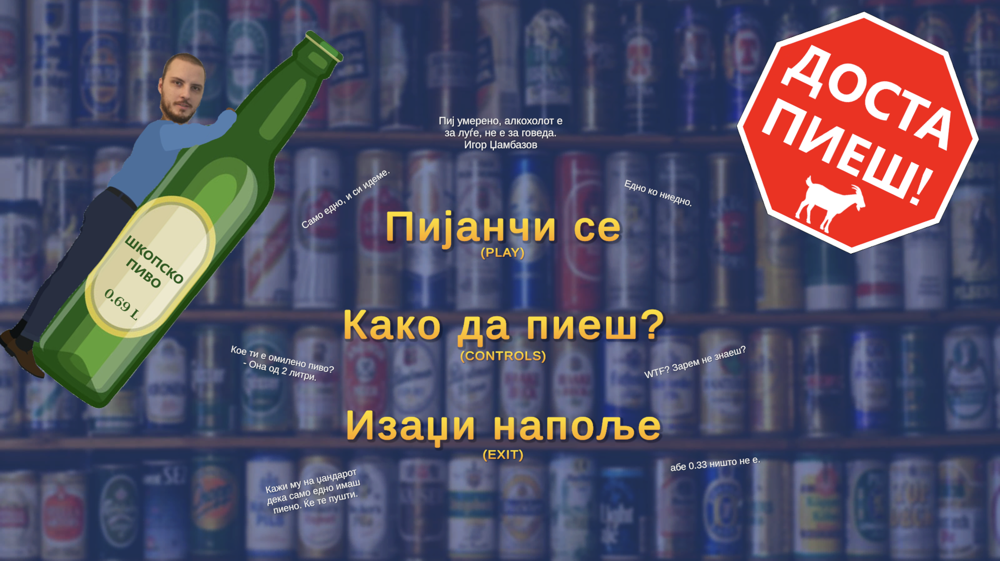
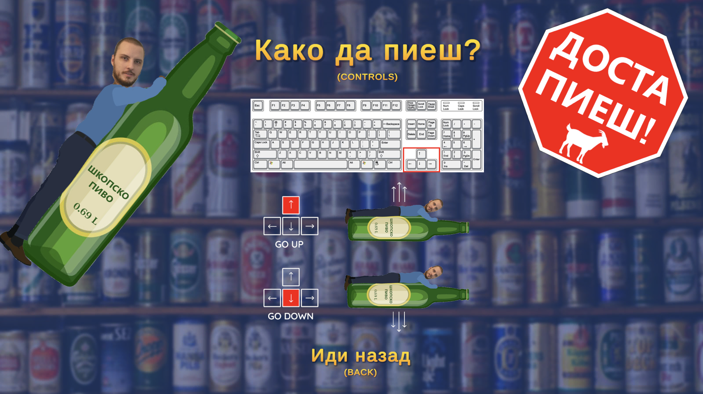
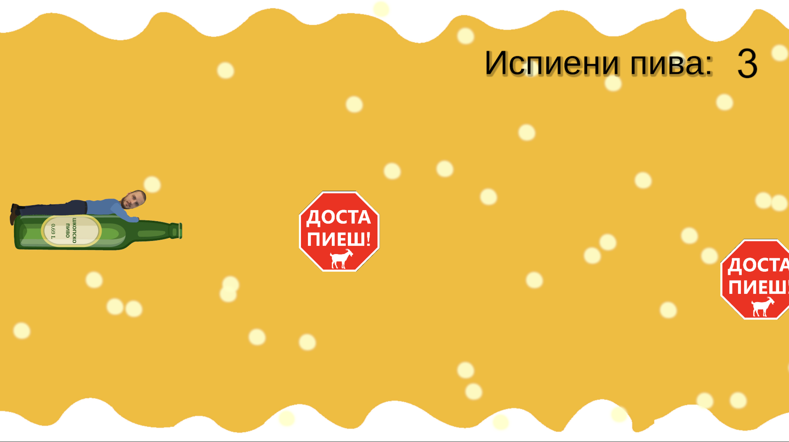
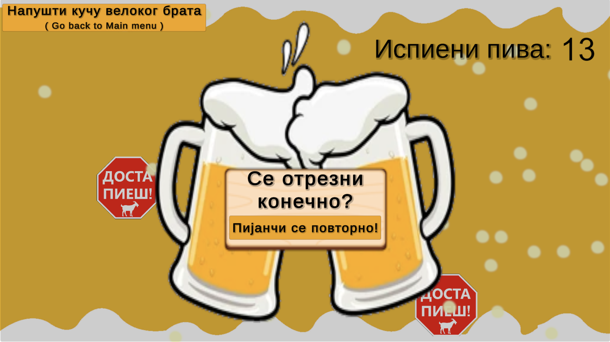

# Документација за индивиуална проектна задача (Видео игра во Unity) со наслов: „Брат за брат, пиво за Љубен" по предметот Визуелно програмирање

## Проектот е изработен од: Петар Христовски 223084

## 1. Објаснување на проблемот

Апликацијата претставува хумористична 2D endless runner игра со наслов „Брат за брат, пиво за Љубен". Целта на оваа игра е да го насмее играчот додека го контролира главниот лик – Љубен, кој има страст за пиво.

Играчот го управува Љубен со помош на стрелките горе и долу на тастатурата, при што мора да ги избегнува препреките во форма на стоп знаци со натпис „Доста пиеш". Доколку Љубен се судри со некоја препрека, играта завршува (game over). Целта е играчот да преживее што е можно подолго, а секоја помината секунда се брои како „испиено пиво", што се прикажува на екранот преку пораката: `Испиени пива: X`

### Главно мени

Во главното мени се достапни следниве опции:

- **Пијанчи се (Play)** – започнување на играта
- **Како да пиеш? (Controls)** – се отвора нов прозорец со визуелно прикажани контроли (стрелки) и кратко упатство
- **Изаџи напоље (Exit Game)** – излегување од апликацијата

### Game Over екран

По судир со препрека, се прикажуваат две опции:

- **Пијанчи се повторно! (Retry/play again)** – започнување одново со играње на играта, каде што поените се 0.
- **Напушти кучу великог брата (Go back to Main Menu)** – враќање назад до главното мени

## 2. Опис на решението

Играта е развиена како 2D endless runner во Unity, со организација базирана на повеќе C# скрипти, секоја задолжена за различен аспект од логиката и функционирањето на играта. Главните класи и нивната улога на кратко се опишани подолу:

| Класа                  | Опис                                                                                                                                                                                                                        |
| ---------------------- | --------------------------------------------------------------------------------------------------------------------------------------------------------------------------------------------------------------------------- |
| `Player.cs`            | Класата која го опишува главниот лик – Љубен. Овде се обработува внесот од тастатурата (стрелки горе/долу) и движењето на ликот. Се користи Rigidbody2D за да се овозможи физичко движење и се детектира судир со препреки. |
| `Obstacle.cs`          | Класа која ги дефинира препреките во играта – знаците со текст „Доста пиеш". Обично се движат хоризонтално кон играчот и ако дојде до судир со Player, предизвикуваат Game Over.                                            |
| `SpawnObsticles.cs`    | <span style="color:red">_(забелешка: има печатна грешка, треба да биде SpawnObstacles)_ </span><br> Оваа скрипта е одговорна за појавување на нови препреки на екранот во одредени интервали.                               |
| `ScoreManager.cs`      | Следи колку време играчот преживеал и го прикажува резултатот во форма: „Испиени пива: X".                                                                                                                                  |
| `MainMenu.cs`          | Содржи логика за функционирање на главното мени.                                                                                                                                                                            |
| `GameOver.cs`          | Оваа скрипта се активира кога ќе дојде до судир меѓу играчот и препрека.                                                                                                                                                    |
| `LoopingBackground.cs` | Креира илузија на бесконечно движење на позадината.                                                                                                                                                                         |
| `CameraMovement.cs`    | Камерата може да се движи или следи делови од сцената.                                                                                                                                                                      |
| `BackgroundMusic.cs`   | Оваа скрипта пушта музика при стартување на играта.                                                                                                                                                                         |

### Генерален поглед на класата: Player.cs

Оваа класа ја контролира логиката за движењето на главниот лик во играта – Љубен. Таа ја користи Rigidbody2D компонента на Unity за физички да го придвижи ликот нагоре и надолу во 2D просторот. Класата го следи внесот од тастатурата и го ажурира движењето во реално време.

```csharp
public float playerSpeed;
private Rigidbody2D rb;
private Vector2 playerDirection;

void Start() {
    rb = GetComponent<Rigidbody2D>();
}

void Update() {
    float directionY = Input.GetAxis("Vertical");
    playerDirection = new Vector2(0, directionY).normalized;
}

void FixedUpdate() {
    rb.linearVelocity = new Vector2(0, playerDirection.y * playerSpeed);
}
```

### Детален опис на класата: Player.cs (Линија по линија)

#### Атрибути на класата

- `public float playerSpeed`

  - Јавна променлива што ја дефинира брзината со која се движи ликот. Оваа вредност може да се подесува преку инспекторот во Unity Editor.

- `private Rigidbody2D rb`

  - Приватна променлива што ја содржи референцата до Rigidbody2D компонентата на објектот. Оваа компонента е задолжена за физиката на објектот (движење, судири итн).

- `private Vector2 playerDirection`
  - Вектор што ја претставува насоката на движење на ликот (во случајов, само вертикално: нагоре или надолу).

### Методи

#### void Start()

```csharp
void Start()
{
    rb = GetComponent<Rigidbody2D>();
}
```

Овој метод се повикува еднаш при стартување на сцената.

Се зема компонента Rigidbody2D од објектот и се зачувува во променливата rb за понатамошна употреба во движењето.

#### void Update()

```csharp
void Update()
{
    float directionY = Input.GetAxis("Vertical");
    playerDirection = new Vector2(0, directionY).normalized;
}
```

Методот `Update()` се повикува секој фрејм (секунда делена на FPS).

Со `Input.GetAxis("Vertical")` се добива внесот од тастатурата (стрелка горе, долу, или W/S, во нашиот случај само со стрелки).

- Вредноста е -1 (долу), 0 (неутрално), или 1 (горе).

`playerDirection` се поставува како вертикален вектор кој се нормализира (да има должина 1) за да се избегнат проблеми при множење со брзина.

#### void FixedUpdate()

```csharp
void FixedUpdate()
{
    rb.linearVelocity = new Vector2(0, playerDirection.y * playerSpeed);
}
```

`FixedUpdate()` се повикува на редовни интервали синхронизирани со физичкиот engine на Unity.

Тука на Rigidbody2D му се поставува линеарна брзина според насоката и дефинираната брзина.

Со ова Љубен се движи нагоре или надолу во зависност од внесот на играчот.

> **❗ Забелешка:**  
> Во оригиналниот Unity API, променливата треба да биде **velocity**, не linearVelocity. Затоа правилниот ред треба да гласи:
>
> ```csharp
> rb.velocity = new Vector2(0, playerDirection.y * playerSpeed);
> ```

## 4. Screenshots, gameplay video и упатство за користење

### Screenshots од играта


_Слика 1: Главното мени на играта_


_Слика 2: Прозорец со контроли и упатство_


_Слика 3: Љубен во акција, избегнувајќи препреки_


_Слика 4: Game Over екранот по завршување на играта_

### Gameplay Video

[](https://youtu.be/FH1GMlNuoFM)

_Video: Демонстрација на играта во акција_

#линк до видео играта на itch.io:

https://pedzo.itch.io/brat-za-brat-pivo-za-ljuben

### Упатство за играње

| Контрола | Акција                |
| -------- | --------------------- |
| ↑        | Љубен се движи нагоре |
| ↓        | Љубен се движи надолу |

**Цел**: Избегнувај ги знаците „Доста пиеш" и собирај што повеќе „испити пива"

**Game Over**: При судир, избери Retry или Main Menu

**Exit Game**: За да ја исклучиш апликацијата
